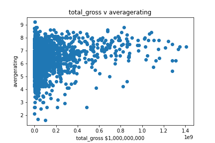

# Project 1 Movie Data Analysis

## Introduction

I was given the question "Microsoft sees all the big companies creating original video content, and they want to get in on the fun. They have decided to create a new movie studio, but the problem is they don’t know anything about creating movies. They have hired you to help them better understand the movie industry. Your team is charged with exploring what type of films are currently doing the best at the box office. You must then translate those findings into actionable insights that the head of Microsoft's new movie studio can use to help decide what type of films to create."

## Objectives

I will answer the three questions:
* 1 - Which genres have the highest ratings?
* 2 - Does the gross product of each movie predict ratings?
* 3 - Which genres have a high gross and which genres have a low gross?
Tables from question 1 and 3 can be compared and contrasted.

## Project Findings

There are many factors which need to be accounted for when trying to became successful in the movie industry. For example, music, sport, history, biography, game-show, documentary, and short movies have the highest ratings. Meanwhile, western, action, thriller, sci-fi, horror, and adult movies have the lowest ratings. It is natural to think more people would like a movie with higher ratings, but this is not necessarily true. Maybe a particular director is really talented, leading that genre to higher ratings or more revenue. Or maybe having a familiar cast leads people to rate movies more favorably. Just because a movie is rated highly does NOT mean a lot of people saw it. It's also possible movie expections were not met. For example, sometimes people don't like the screen version of their favorite book. Or maybe a movies good advertisements didn't reflect the quality of the movie. Or maybe there was an outpouring of people who went to see a familiar cast, but the movie itself was still didn't meet the consumers expectations, thus they rated the movie harshly. The gross product did NOT predict ratings. The most popular genres did not lead to the most revenue. For example, documentary, news, and biography are highly rated genres, but they brought in less revenue than Action and Fantasy which were genres with low ratings.

### The Data

I used these files from within the `zippedData` folder

* imdb.title.basics
* imdb.title.ratings
* bom.movie_gross

Question 1 - Which genres have the highest ratings?

{'Action': 5.810360618202613, 'Adult': 3.766666666666667, 'Adventure': 6.196201205134906, 'Animation': 6.248307515777409, 'Biography': 7.162273562614873, 'Comedy': 6.002689415847302, 'Crime': 6.115441335935799, 'Documentary': 7.332090350926571, 'Drama': 6.401559048980236, 'Family': 6.394724501758511, 'Fantasy': 5.919473189087487, 'Game-Show': 7.3, 'History': 7.040955752212392, 'Horror': 5.00344018764659, 'Music': 6.930521936459925, 'Musical': 6.498335644937577, 'Mystery': 5.920401447844683, 'News': 7.2713298791018985, 'Reality-TV': 6.499999999999999, 'Romance': 6.146607983001951, 'Sci-Fi': 5.4897552130552985, 'Short': 8.8, 'Sport': 6.961492790500417, 'Thriller': 5.639114031885117, 'War': 6.584290738569757, 'Western': 5.868214285714282}

The average overall rating is a 6.35. 
The top 25% movies have a rating over 6.92. T
he lowest 25% of movies have a rating below 5.92. 
The highest rated genre has an mean rating of 8.8 while the lowest rated genre has a mean rating of 3.77.

Question 2 - Does the movie's gross product predict ratings?

The correlation between total_gross and averagerating is 0.165889. Therefore there is virtually no correlation between total_gross and averagerating. Consumers watching a movie does NOT mean they like a movie. 

Question 3 - Which genres have the highest/lowest gross?

Action, Adventure, Animation, Fantasy, Family, and Sci-Fi movies generate the most revenue. The most popular genres did not lead to the most revenue. For example, documentary, news, and biography are highly rated genres, but they brought in less revenue than Action and Fantasy which were genres with low ratings.
